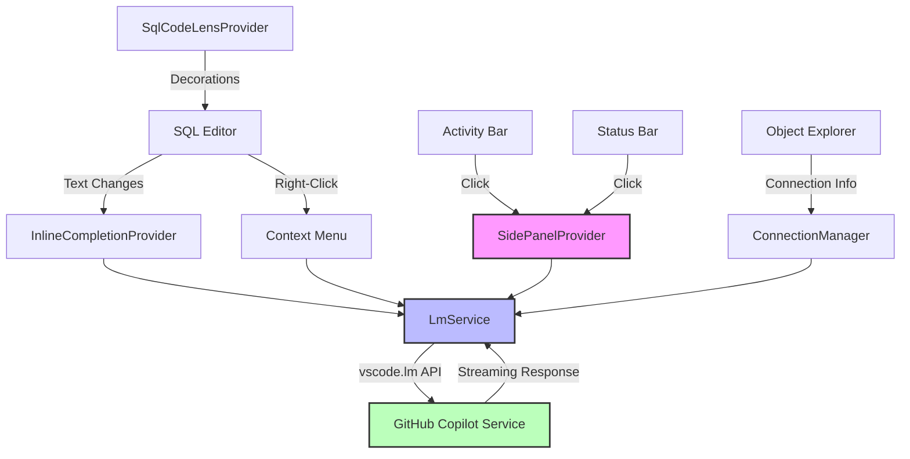

# GitHub Copilot for Azure Data Studio

An Azure Data Studio extension that brings **GitHub Copilot** AI assistance directly into your SQL workflow with intelligent completions, interactive chat, and powerful query tools.

---

## ✨ Features

### 🤖 Interactive Chat Side Panel
A dedicated Copilot chat interface in the activity bar for conversational SQL assistance:

- **Multi-model support** — select from GPT-4o, GPT-4o mini, Claude 3.5 Sonnet, and more
- **Context-aware conversations** — automatically includes active database schema
- **Add to Chat** — send selected SQL or entire documents to the chat with `Ctrl+Shift+/`
- **Code actions** — insert generated SQL directly into your editor or copy to clipboard
- **GitHub authentication** — secure access to language models
- **Persistent history** — maintain conversation context across sessions

### ⚡ Inline SQL Completions
AI-powered ghost text suggestions as you type:

- **Context-aware** — analyzes your entire SQL file for relevant completions
- **Schema-aware** — leverages active database connection metadata (tables, columns, relationships)
- **Smart debouncing** — only triggers when you pause typing
- **Tab to accept** — seamless integration with your existing workflow

### 🔍 CodeLens Actions
Quick actions above each SQL statement:

```sql
✨ Explain  🚀 Optimize  🔧 Fix
SELECT id, name FROM customers WHERE created_at > '2026-01-01'
```

Click any CodeLens to:
- **Explain** — get plain-English explanations of complex queries
- **Optimize** — receive performance improvement suggestions
- **Fix** — automatically resolve syntax or logical errors

### 🛠️ SQL Commands

| Command | Shortcut | Description |
|---------|----------|-------------|
| **Explain Query** | `Ctrl+Shift+E` | Explain selected SQL in plain English |
| **Generate SQL** | — | Create SQL from natural language description |
| **Fix SQL Error** | — | Fix syntax errors with optional error message context |
| **Optimize Query** | — | Get performance improvement recommendations |
| **Add to Chat** | `Ctrl+Shift+/` | Send selection or document to chat panel |

### 📋 Context Menu Integration
Right-click in any SQL file to access the **Copilot** submenu with all available actions.

### 📊 Status Bar Indicator
A `$(sparkle) Copilot` status bar item appears when editing SQL files — click to open the chat panel.

---

## 🚀 Getting Started

### Prerequisites

| Requirement | Version | Purpose |
|-------------|---------|---------|
| **Azure Data Studio** | ≥ 1.40 | Host application |
| **GitHub Copilot** extension | Latest | Provides language model API access |
| **GitHub Copilot subscription** | Active | Required for AI features |
| **GitHub account** | — | Authentication for chat panel |

> **Note:** The GitHub Copilot Chat extension is **not required** — this extension provides its own dedicated chat interface.

### Installation

#### Option 1: From VSIX
1. Download the latest `.vsix` from [Releases](https://github.com/RatherFancyCat/ADS-Copilot-Integration/releases)
2. In Azure Data Studio: **File → Install Extension from VSIX…**
3. Select the downloaded file and restart ADS

#### Option 2: From Source
```bash
git clone https://github.com/RatherFancyCat/ADS-Copilot-Integration.git
cd ADS-Copilot-Integratioon
npm install
npm run compile
npm run package
```
Then install the generated `.vsix` file as described above.

### First-Time Setup

1. Open Azure Data Studio with a SQL file
2. Click the **Copilot** icon in the activity bar (left sidebar)
3. Click **Sign in with GitHub** in the chat panel
4. Select your preferred AI model from the dropdown
5. Start chatting or use inline completions!

---

## ⚙️ Configuration

Configure the extension via **File → Preferences → Settings** (search for "ads-copilot"):

| Setting | Default | Description |
|---------|---------|-------------|
| `ads-copilot.enable` | `true` | Master toggle for all features |
| `ads-copilot.inlineCompletions` | `true` | Enable inline ghost-text completions |
| `ads-copilot.includeSchemaContext` | `true` | Include database schema in AI prompts |
| `ads-copilot.codeLens` | `true` | Show CodeLens actions above SQL statements |
| `ads-copilot.model` | `gpt-4o` | Default language model (can override in chat UI) |
| `ads-copilot.maxTokens` | `1024` | Maximum tokens for completions |
| `ads-copilot.logLevel` | `info` | Logging verbosity (`error`/`warn`/`info`/`debug`) |

---

## 🎯 Usage Examples

### Generate SQL from Description
1. Run **ADS Copilot: Generate SQL from Description** from the Command Palette (`F1`)
2. Enter: _"List all orders from the last 30 days with customer name and total amount"_
3. The generated SQL is automatically inserted at your cursor

### Fix a Query with Error Context
1. Select a broken SQL query
2. Run **ADS Copilot: Fix SQL Error**
3. Paste the error message from the Messages panel (optional)
4. Review the fixed query and insert it

### Interactive Chat Session
1. Open the Copilot panel from the activity bar
2. Ask: _"How can I optimize this query for better index usage?"_
3. Add your query to the chat with `Ctrl+Shift+/`
4. Review suggestions and click **Insert** to apply changes

---

## 🏗️ Architecture



### Components

1. **InlineCompletionProvider** — Monitors SQL editor, builds context-aware prompts, returns ghost-text suggestions
2. **SidePanelProvider** — WebView-based chat interface with GitHub auth, model selection, and conversation history
3. **ConnectionManager** — Wraps `azdata.connection` API to extract active database schema metadata
4. **LmService** — Central service that interfaces with VS Code's Language Model API (`vscode.lm`)
5. **SqlCodeLensProvider** — Injects Explain/Optimize/Fix actions above SQL statements
6. **ChatPanel** — Alternative panel-based chat UI (legacy, less featured than side panel)

### Supported Languages
- `sql` (T-SQL, SQL Server)
- `pgsql` (PostgreSQL)
- `mysql` (MySQL/MariaDB)

---

## 🔧 Development

### Setup
```bash
npm install          # Install dependencies
npm run compile      # Compile TypeScript
npm run watch        # Watch mode for development
```

### Testing
```bash
npm test            # Run unit tests
```

### Debugging
1. Open the project in VS Code or Azure Data Studio
2. Press `F5` to launch the Extension Development Host
3. Set breakpoints in `src/` files
4. Check the **Output** panel → **GitHub Copilot for ADS** for logs

### Project Structure
```
src/
├── extension.ts              # Extension activation & command registration
├── managers/
│   ├── connectionManager.ts  # Database connection & schema context
│   └── lmService.ts          # Language Model API wrapper
├── providers/
│   ├── chatParticipant.ts    # Chat participant (no-op in ADS)
│   ├── codeLensProvider.ts   # CodeLens actions above SQL statements
│   └── inlineCompletionProvider.ts # Ghost text completions
├── ui/
│   ├── chatPanel.ts          # Standalone chat panel
│   └── sidePanelProvider.ts  # Activity bar WebView chat
└── utils/
    ├── config.ts             # Configuration helpers
    ├── logger.ts             # Logging infrastructure
    └── sqlUtils.ts           # SQL parsing utilities
```

---

## 🤝 Contributing

Contributions are welcome! Please feel free to submit issues and pull requests at [RatherFancyCat/ADS-Copilot-Integration](https://github.com/RatherFancyCat/ADS-Copilot-Integration).

### Guidelines
- Follow the existing code style (TypeScript with strict mode)
- Add tests for new features
- Update documentation as needed
- Ensure `npm run compile` succeeds without errors

---

## 📄 License

MIT — see [LICENSE](LICENSE) for details.

---

## ❓ FAQ

**Q: Why isn't the `@sql` chat participant working?**  
A: Azure Data Studio is based on VS Code 1.82, which doesn't include the `vscode.chat` API (introduced in VS Code 1.86). Use the dedicated activity bar chat panel instead.

**Q: Do I need GitHub Copilot Chat?**  
A: No, this extension provides its own chat interface. GitHub Copilot (the base extension) is required for language model access.

**Q: How do I change the AI model?**  
A: Open the Copilot side panel and use the model selector dropdown at the top.

**Q: Why aren't inline completions appearing?**  
A: Ensure `ads-copilot.inlineCompletions` is enabled, you're signed in to GitHub Copilot, and you're editing a SQL file.

**Q: Can I use this with VS Code?**  
A: You can... but why would you use this version in specific for VS Code? 